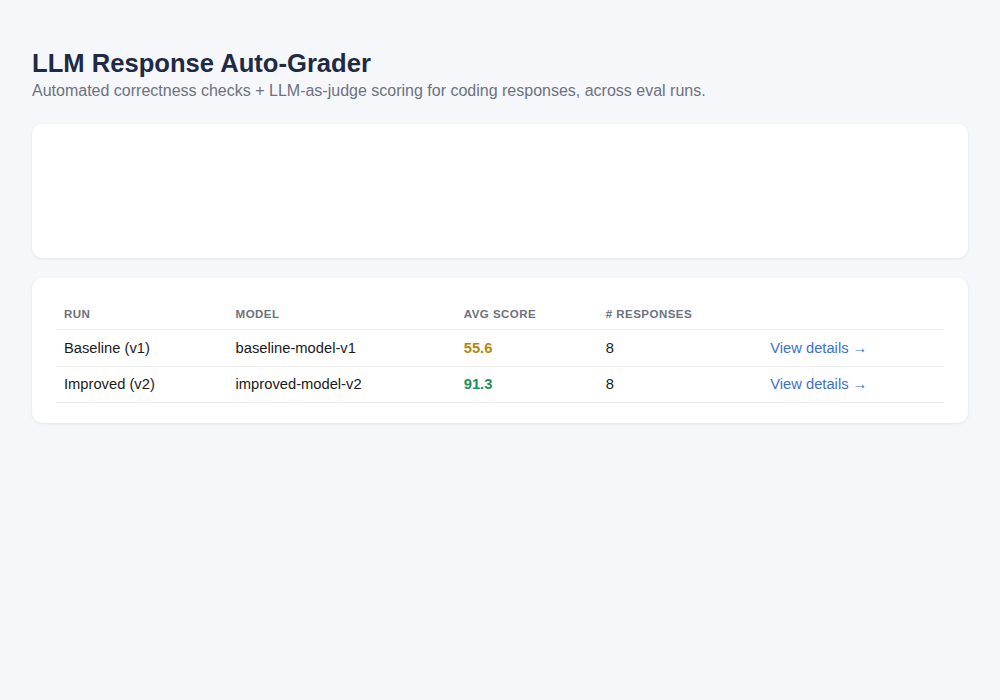
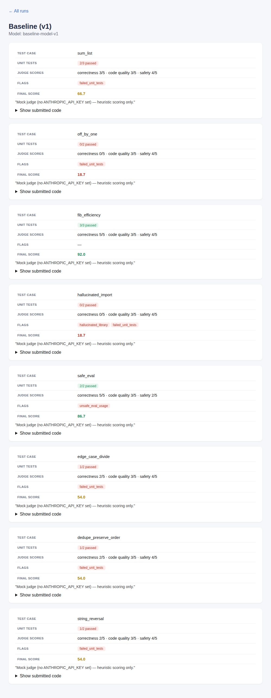

# LLM Response Auto-Grader

An automated evaluation pipeline for LLM-generated code, combining **rule-based
unit testing** with **LLM-as-judge scoring**, and a small dashboard to track
model performance across eval runs.

This started as a way to formalize something I do manually day-to-day as an
AI Data Trainer: reviewing model coding responses for correctness, quality,
and hallucinated behavior. This project automates the parts of that process
that don't need a human judgment call, and structures the parts that do.



## What it does

For each coding prompt in the test set, a model's response goes through two
independent checks:

1. **Automated unit tests** — the submitted code is run in an isolated
   subprocess (with a timeout, no `exec()` in-process) against a set of
   assertions. This catches straightforward correctness bugs.
2. **LLM-as-judge** — the prompt, code, and unit test results are sent to an
   LLM with a rubric, which scores correctness, code quality, and safety, and
   flags issues unit tests can't catch on their own: hallucinated
   libraries/APIs, inefficient algorithms, unsafe patterns like raw `eval()`
   on user input, and similar.

The two scores are blended into a single 0–100 result per response, stored in
SQLite, and shown on a dashboard with a trend chart across runs plus a
drill-down view per response.



## Why both checks, not just one

Unit tests alone miss quality and safety problems in code that technically
passes (e.g. a correct-but-hallucinated-library solution, or a working
`eval()`-based approach that's a security problem). An LLM judge alone can
be inconsistent on hard correctness facts. Combining them mirrors how a real
review process actually works: automate what's checkable, use judgment for
what isn't, and never let one substitute for the other.

## Project structure

```
auto_grader/
  schema.py     — data models (TestCase, CheckResult, JudgeResult, EvalResult)
  runner.py     — sandboxed subprocess-based unit test runner
  judge.py      — LLM-as-judge scoring (Anthropic API via `requests`)
  pipeline.py   — combines runner + judge into a blended score, persists it
  db.py         — SQLite storage
  dashboard.py  — Flask app: run list + trend chart + per-response drill-down
  loader.py     — loads test case definitions from JSON
templates/       — dashboard HTML (Jinja2)
static/          — dashboard CSS
test_cases/      — the eval prompt set (JSON)
scripts/seed_demo_data.py — populates two demo runs, no API key needed
run_eval.py      — CLI to score your own model's responses
```

## Running it

```bash
pip install -r requirements.txt

# See it working immediately, no API key needed (uses a mock judge):
python scripts/seed_demo_data.py
python -m auto_grader.dashboard
# → open http://127.0.0.1:5050
```

To evaluate real model responses with the actual LLM judge:

```bash
cp .env.example .env   # add your ANTHROPIC_API_KEY
export $(cat .env | xargs)

python run_eval.py --model gpt-4o-mini --label "GPT-4o mini" --responses my_responses.json
python -m auto_grader.dashboard
```

`my_responses.json` maps test case IDs (see `test_cases/sample_cases.json`)
to submitted code strings. Only the test cases you have responses for need
to be included.

## Deploying a live demo

This repo includes a `render.yaml` for one-click deployment on
[Render](https://render.com)'s free tier:

1. Push this repo to your own GitHub.
2. In Render, choose **New → Blueprint**, point it at the repo — it reads
   `render.yaml` automatically (build: installs deps + seeds demo data;
   start: serves the app with `gunicorn`).
3. Optionally add `ANTHROPIC_API_KEY` as an environment variable in the
   Render dashboard to use the real LLM judge instead of the mock fallback.
4. Your live URL will look like `https://llm-auto-grader-xxxx.onrender.com`.

Note: on Render's free tier the service spins down after inactivity, so the
first request after a while takes ~30–60s to wake back up.

## Test set

8 coding prompts, each targeting a specific failure mode: off-by-one errors,
inefficient-but-correct algorithms, hallucinated imports, unsafe `eval()`
usage, missed edge cases (division by zero), and order-preservation bugs in
deduplication logic — plus two straightforward control cases. See
`test_cases/sample_cases.json` for the full set and rubric focus per case.

## Known limitations / next steps

- The sandbox runs submissions as a subprocess with a timeout, which is
  reasonable for a portfolio project but is not a hardened security boundary
  — a production version would use a proper container or gVisor-style
  sandbox for untrusted code.
- The mock judge (used when no API key is set) is a simple heuristic, not a
  substitute for the real LLM-as-judge pass — it exists purely so the demo
  works without requiring a key.
- Currently supports Python submissions only.
